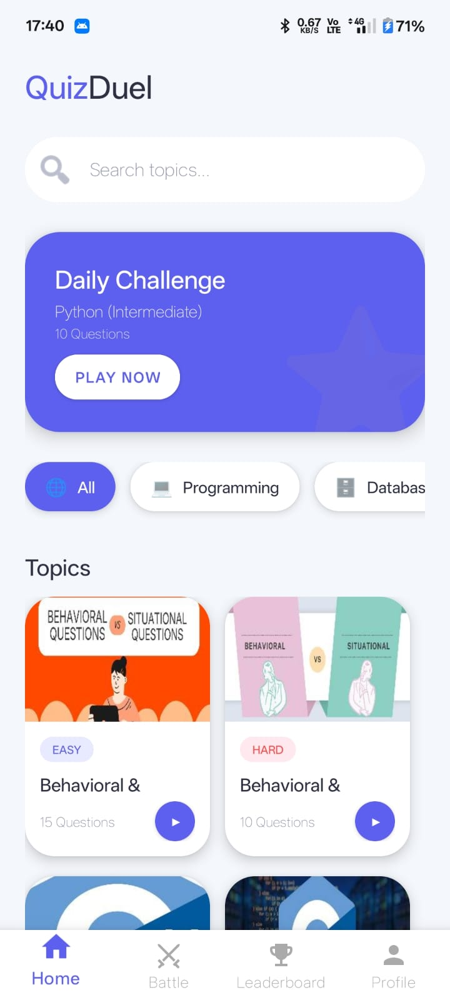
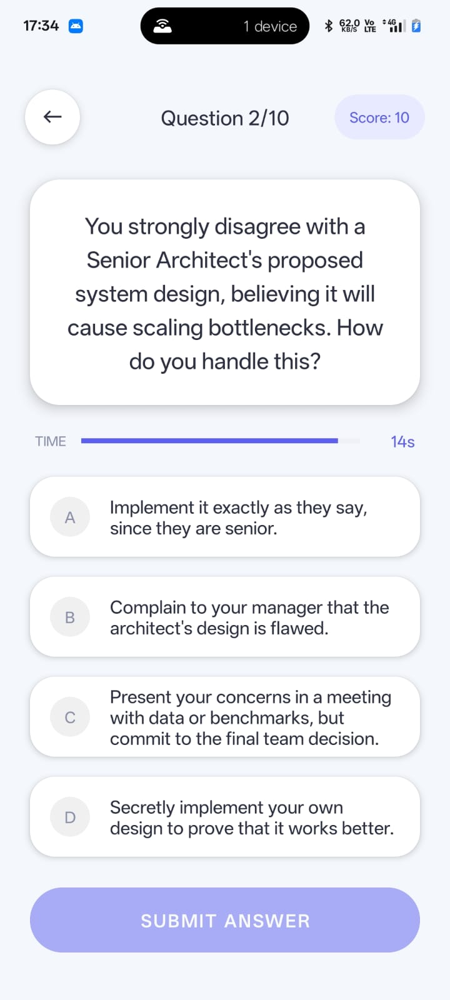
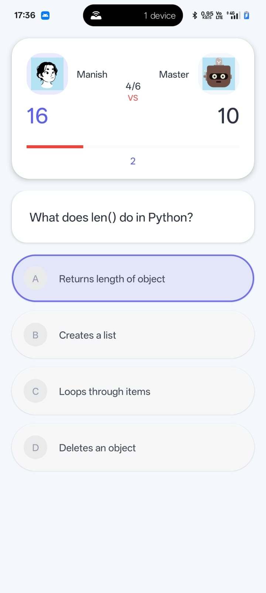
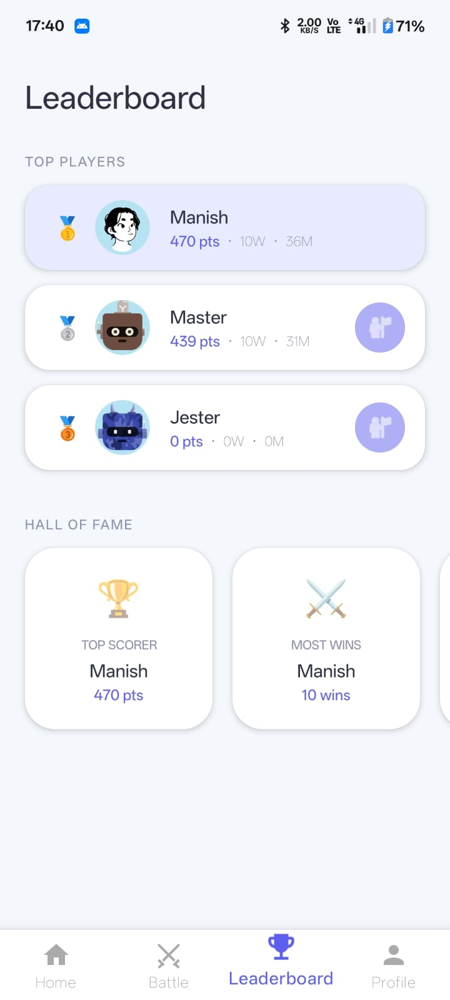

# 🎯 QuizDuel

## 🧾 Overview  
QuizDuel is a **real-time multiplayer quiz battle Android app** where users can compete with friends or random opponents in synchronized quiz matches.  
Built using **Kotlin, MVVM architecture, and Firebase Realtime Database**, the app focuses on **live gameplay, fair scoring, and smooth network handling**, ensuring a competitive and reliable quiz experience.

---

## 🚀 Features

### 🧠 Quiz System
- Single-player quiz mode  
- Multiple-choice questions  
- Timer-based answering system  

### ⚔️ Multiplayer Battle
- Quick Match (auto matchmaking)  
- Create Room & Invite Friends  
- Join Room via Code  
- Real-time synchronized gameplay  

### 👥 Social Features
- Friends module  
- Invite friends to battles  
- Battle history tracking  

### 🏆 Leaderboard
- Global ranking based on total score  
- Highlights top players  
- Real-time updates  

### 🎯 Daily Challenge
- One challenge per day  
- Fixed topic for all users  
- Single attempt tracking  

### 📡 Real-Time Sync (Core Feature)
- Live question synchronization between players  
- Answer comparison with time-based scoring  
- Instant result calculation  
- Fair gameplay with synchronized timers  

### 🌐 Network Handling (Advanced)
- Instant opponent disconnect detection  
- Handles internet loss gracefully  
- Prevents stuck matches using:
  - Firebase `onDisconnect()`
  - Heartbeat (`lastSeen`) mechanism  

### 📥 Offline Support
- Quiz topics auto-download when internet is available  
- Play quizzes offline without connection  

---

## 📸 Screenshots

  
  

  
  
  

---

## 🧱 Tech Stack

### 📱 Android
- Kotlin  
- MVVM Architecture  
- ViewBinding  
- Navigation Component  

### ☁️ Firebase
- Firebase Authentication (Email/Password)  
- Firebase Realtime Database (real-time multiplayer sync)  

### 🎨 UI
- Material Components  
- ConstraintLayout  
- RecyclerView + CardView  
- Lottie Animations  

### 🖼️ Image Loading
- Glide (topic images)  
- Coil + SVG (DiceBear avatars)  

### ⚡ Async Handling
- Kotlin Coroutines  
- Firebase Realtime Listeners  

---

## 🧠 Modules

- Authentication Module  
- Quiz Engine Module  
- Multiplayer Module  
- Real-Time Sync Module  
- Friends Module  
- Battle History Module  

---

## 📥 Download APK

👉 [Download Latest Version](https://github.com/ManishGowda03/QuizDuel/releases/download/v1.0/quizduel.apk)

---

## ⚠️ Important Note

`google-services.json` is not included for security reasons.  
Add your own Firebase configuration file from Firebase Console.

---

## 👨‍💻 Author

**Manish Gowda**
